# Practica1
Gerhard Benjamin Ardon Valdez - 202004796
Sebastian Alejandro Velasquez Bonilla - 202006635
Pablo Javier Batz Contreras - 20190298

---
## Descripcion de niveles 
El primer nivel contará con equipo (VPC) para la administración, otro más para la gerencia 
junto con su secretaria, 2 para la atención al cliente y 6 para uso de recursos humanos. 

El segundo nivel contará con 12 equipos en total repartidos en las distintas oficinas que lo 
componen (3 en la oficina A, 6 en la B y el resto en la C). 

El tercer nivel contará con 5 equipos en total repetidos en las distintas oficinas que lo 
componen (1 en la recepción, 3 en Ti y 1 en ventas)
**Nivel 1:**
| IP            | Descripción       |
|---------------|-------------------|
| 192.168.19.101| administracion_N1 |
| 192.168.19.102| atencion_N1       |
| 192.168.19.103| atencion_N1       |
| 192.168.19.104| gerencia_N1       |
| 192.168.19.105| gerencia_N1       |
| 192.168.19.106| recursos_N1       |
| 192.168.19.107| recursos_N1       |
| 192.168.19.108| recursos_N1       |
| 192.168.19.109| recursos_N1       |
| 192.168.19.110| recursos_N1       |
| 192.168.19.111| recursos_N1       |

**Nivel 2:**
| IP            | Descripción      |
|---------------|------------------|
| 192.168.19.20| oficina A |
| 192.168.19.21| oficina A |
| 192.168.19.22| oficina A |
| 192.168.19.23| oficina B |
| 192.168.19.24| oficina B |
| 192.168.19.25| oficina B |
| 192.168.19.26|  oficina B|
| 192.168.19.27|  oficina B|
| 192.168.19.28|  oficina B|
| 192.168.19.29|  oficina C|
| 192.168.19.210| oficina C|
| 192.168.19.211| oficina C|

**Nivel 3:**
| IP            | Descripción       |
|---------------|-------------------|
| 192.168.19.30| recepcion       |
| 192.168.19.31| area de ti      |
| 192.168.19.32| area de ti      |
| 192.168.19.33| area de ti      |
| 192.168.19.34| area de ventas  |

## Configuracion de las areas 
- Administracion
  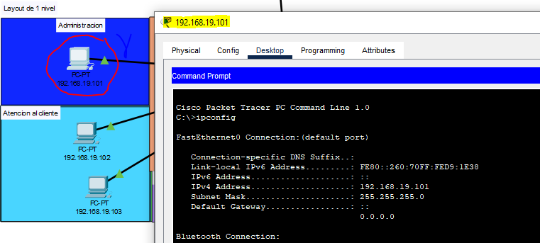
- Atencion al cliente
  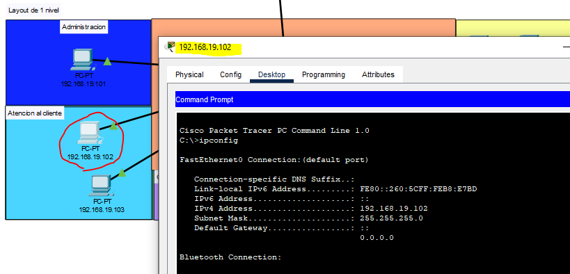
- Gerencia 
  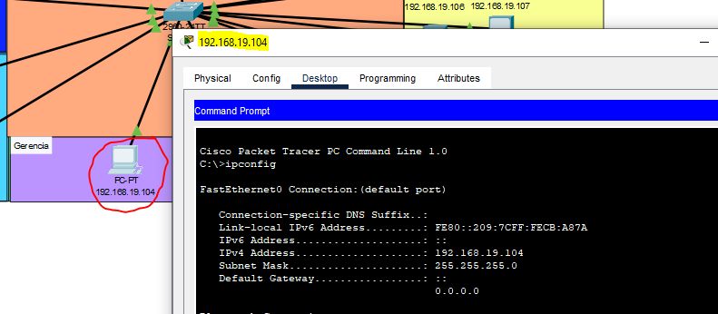
- Recursos humanos
  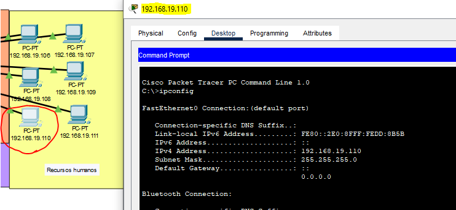
- Oficina A
  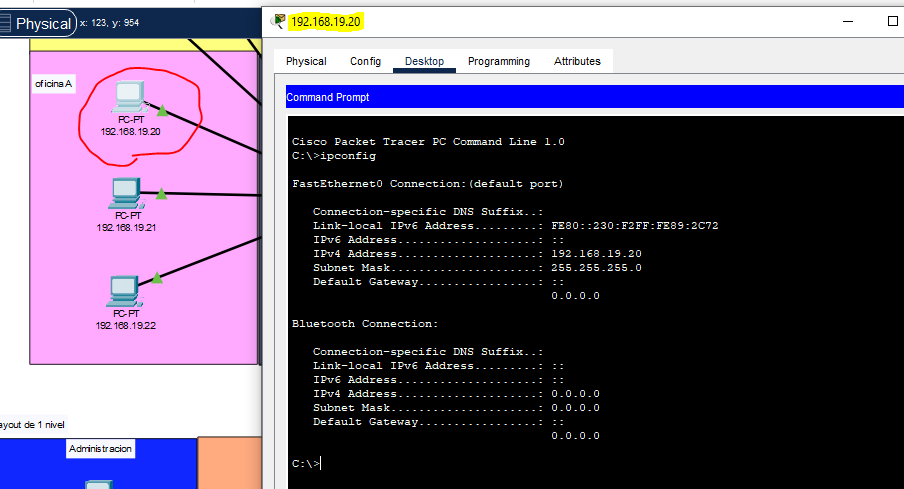
- Oficina B
  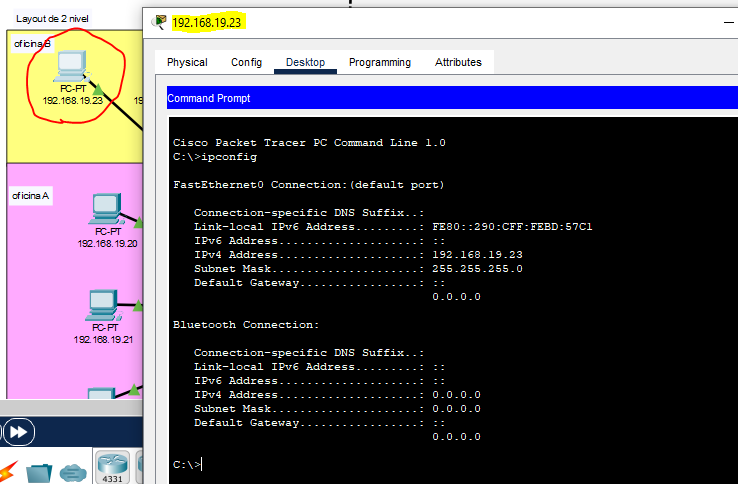
- Oficina C
  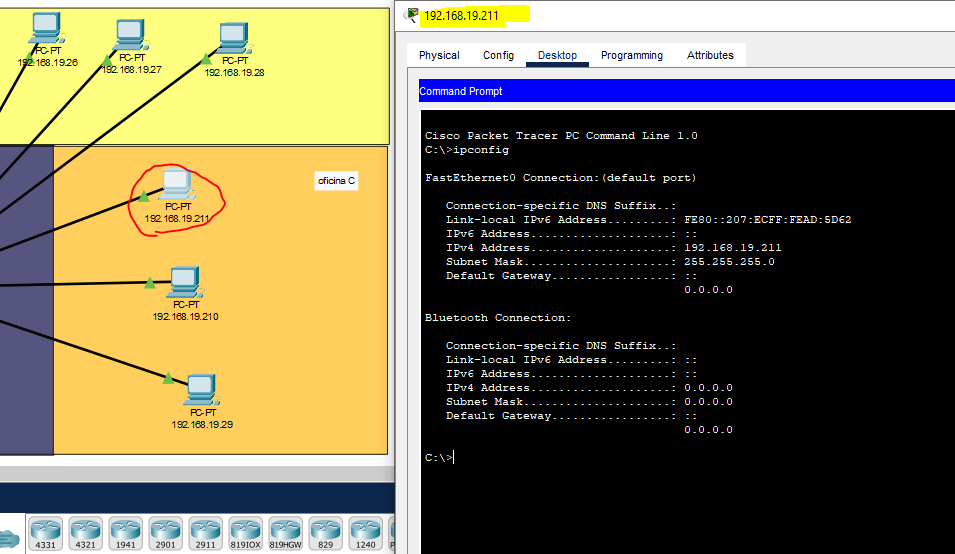
- Recepcion 
  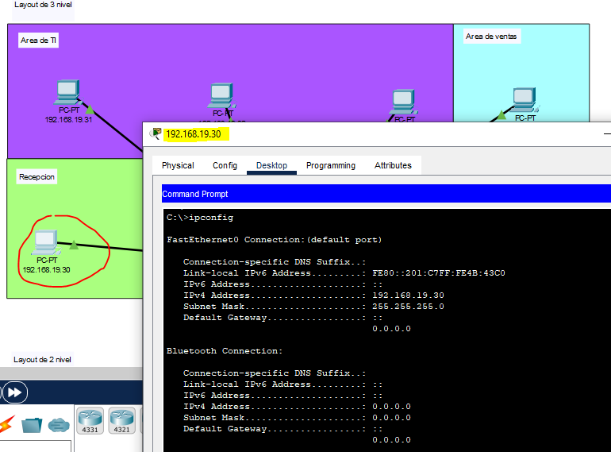
- Area de IT
  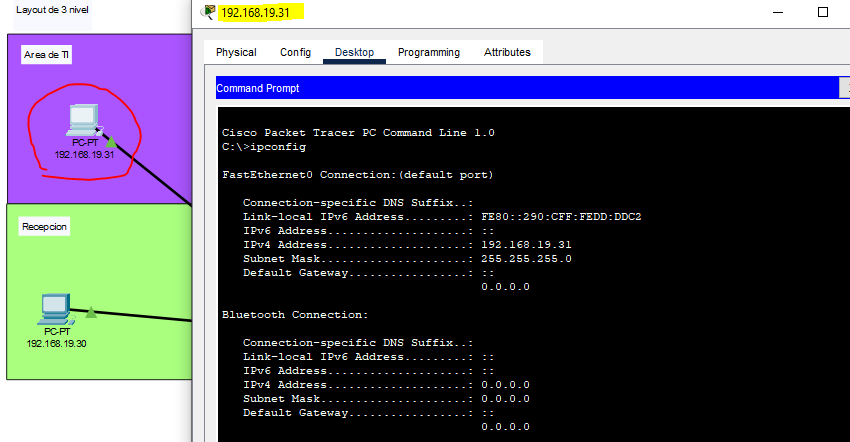
- Area de ventas
  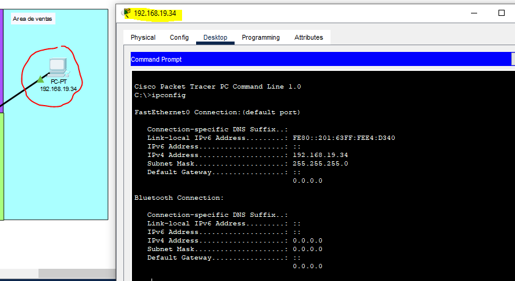

## Pings entre los hosts
Comunicación entre las areas:
- Area de TI - Area de Ventas 
  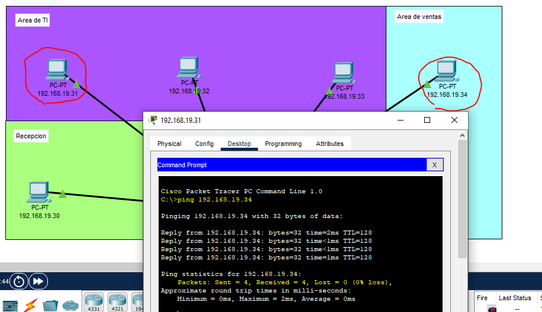
- Recepcion - Recursos humanos 
  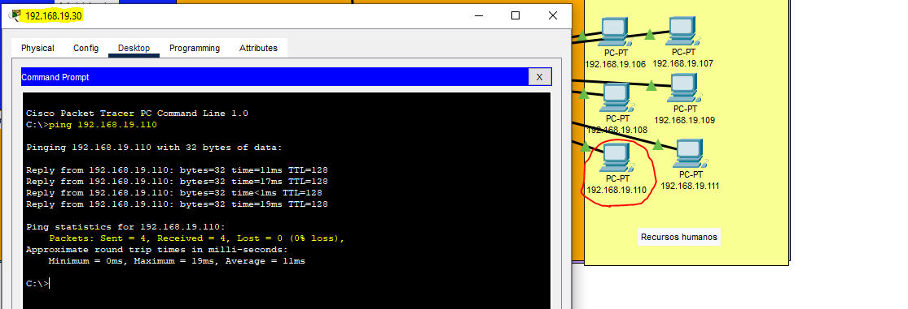
- Atencion al cliente - Administracion
  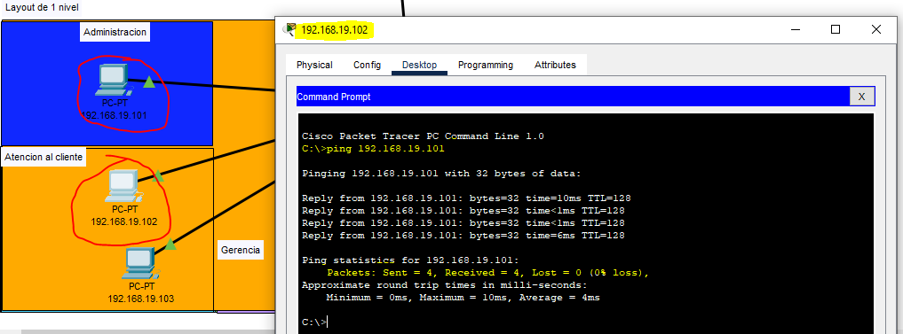
- Oficina A - Oficina C
  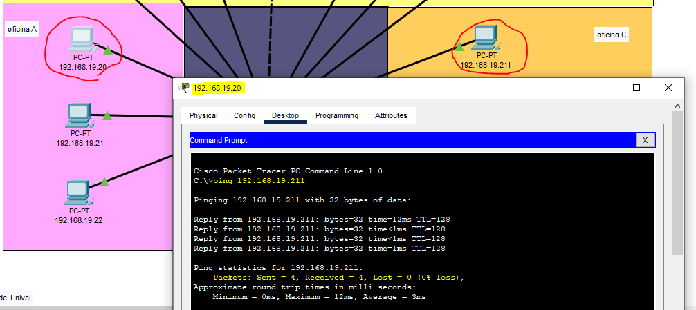
- Oficina B - Area de ventas
  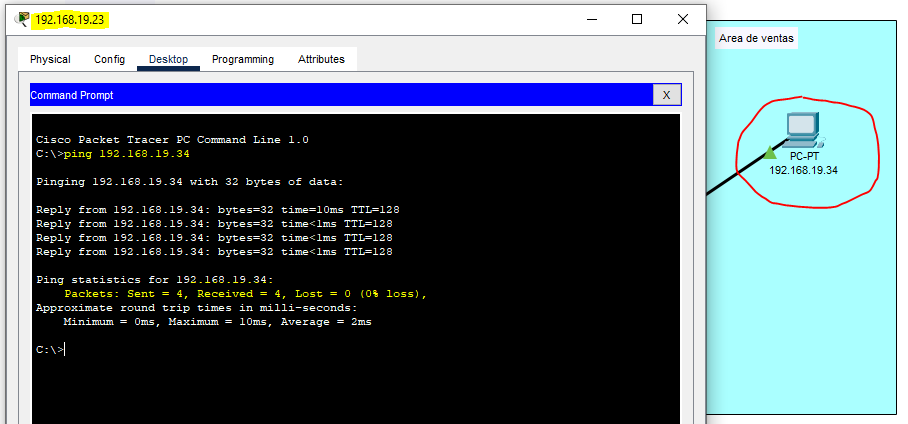 

## Demostración de un paquete ARP/ICMP

Test desde 192.168.19.31 hasta 192.168.19.101
  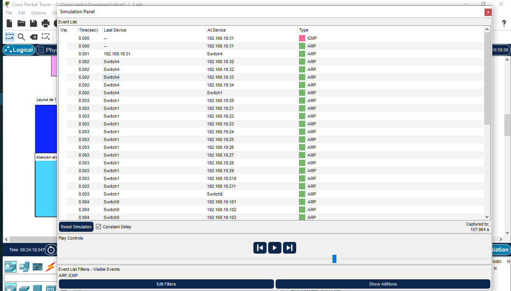
  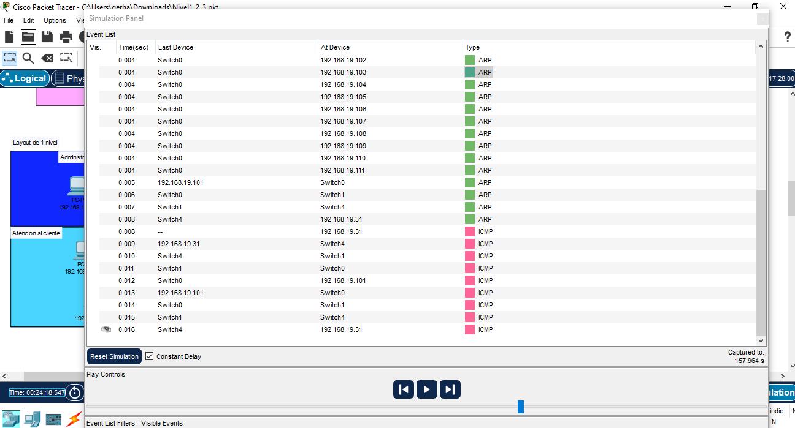
