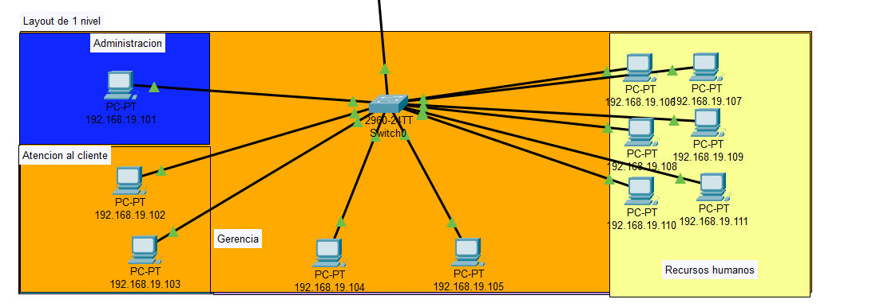
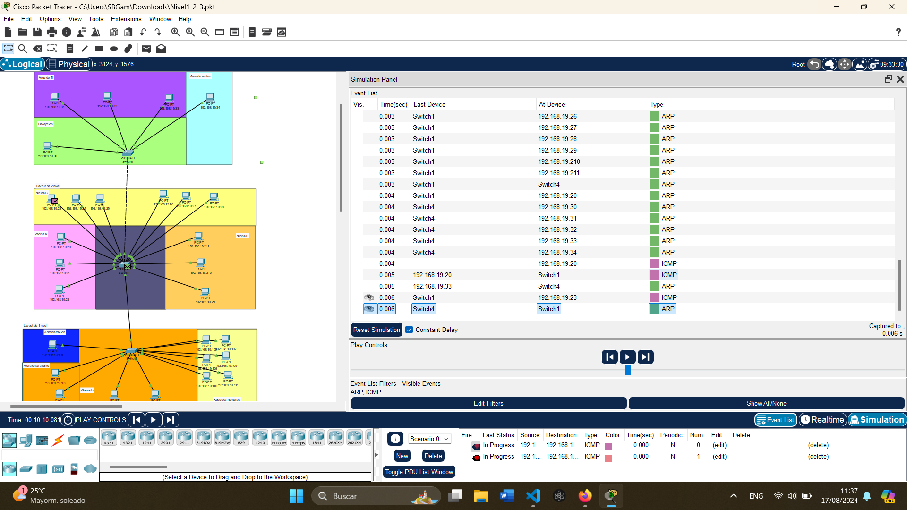
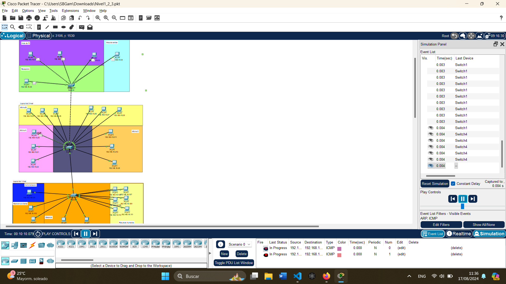

# Practica1 

**Nivel 1:**
| IP            | Descripción       |
|---------------|-------------------|
| 192.168.19.101| administracion_N1 |
| 192.168.19.102| atencion_N1       |
| 192.168.19.103| atencion_N1       |
| 192.168.19.104| gerencia_N1       |
| 192.168.19.105| gerencia_N1       |
| 192.168.19.106| recursos_N1       |
| 192.168.19.107| recursos_N1       |
| 192.168.19.108| recursos_N1       |
| 192.168.19.109| recursos_N1       |
| 192.168.19.110| recursos_N1       |
| 192.168.19.111| recursos_N1       |

## Asignación de Dirección IP a la VPC

### 1. Acceso a la Configuración de la VPC
- Haga clic en la VPC que desea configurar para abrir su menú de configuración.

### 2. Navegación hasta la Configuración de IP
- En el menú de configuración de la VPC, busque y seleccione la pestaña "Desktop".

### 3. Entrada a la Gestión de IP
- Dentro de la pestaña "Desktop", localice y seleccione "IP Configuration" para abrir la ventana de configuración de los parámetros de red de la VPC.

### 4. Establecimiento de la Dirección IP
- En el campo "IP Configuration", introduzca manualmente la dirección IP que desea asignar a la VPC, incluyendo la máscara de subred correspondiente.

# Demostración de un paquete ARP/ICMP

***Desde gerencia 104 al area de TI, (Vista de paquetes)***

