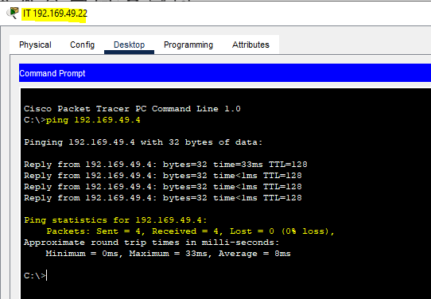
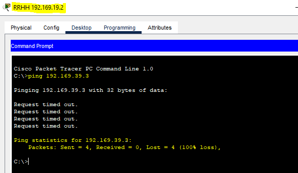

# Proyecto1 
Gerhard Benjamin Ardon Valdez - 202004796
Sebastian Alejandro Velasquez Bonilla - 202006635
Pablo Javier Batz Contreras - 20190298

---
## Resumen de VLAN 
- RRHH           19
- Secretaria     29
- Contabilidad   39
- IT             49


## Resumen de IPs
Para las IPs se utilizó el siguiente formato **192.169.VLAN.X** en donde:
- VLAN es el numero de vlan al que pertenece la pc (19,29,39,49)
- X es el numero del dispositivo (la cuenta inicia en area central con 1, area administratiba con 11, oficina A con 21)

### Area central 
Topologia usada

Configuarcion de la VLAN desde el server sw1


#### Conf de Server


#### Conf de clients
Se utilizaron los siguientes comandos (f0/x cambia dependiendo del puerto, VLAN cambia dependiendo del dispositivo)
```
enable
conf t 
vtp domain G15
vtp password usac
vtp version 2 
vtp mode client

int f0/1
switchport trunk encapsulation dot1q
switchport mode trunk
switchport trunk allowed vlan 19,29,39,49,1002-1005

int f0/2
switchport mode access
switchport access vlan 40
```

### Oficina A

- Configuracion SW11, SW12, SW13.

- Configuracion SW11 CLIENTE


- Configuracion SW12 CLIENTE


- Configuracion SW13 CLIENTE


- Configuracion Access mode y trunk mode
  


- Vlans finales 
  


## Pings

Ping entre Secretaria


Ping entre IT


Ping entre RRHH y Contabilidad (no deberia de funcionar)

