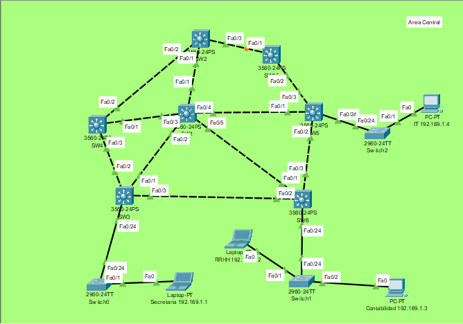
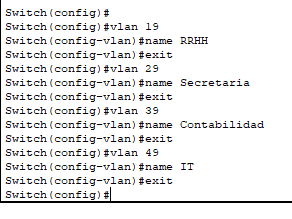
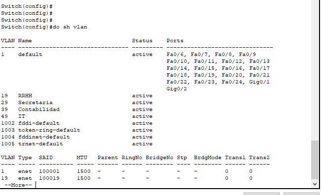
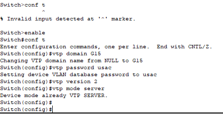
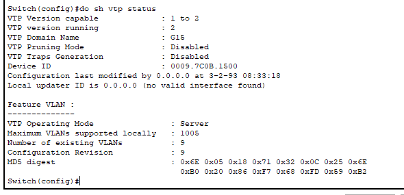
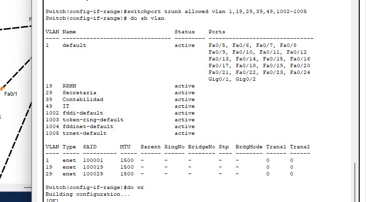
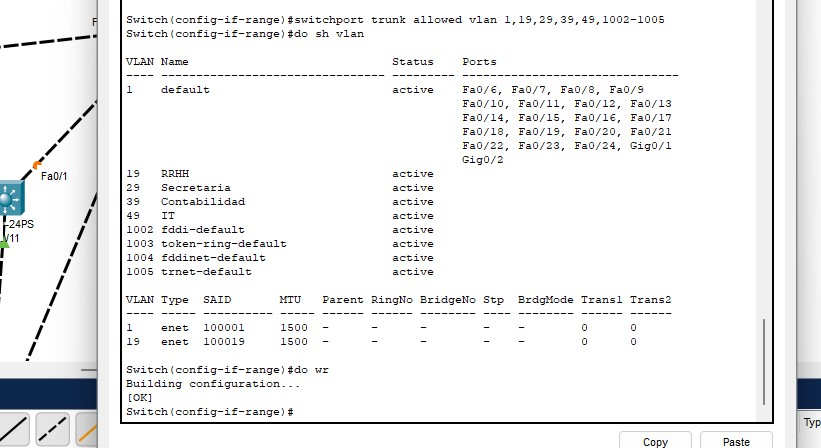
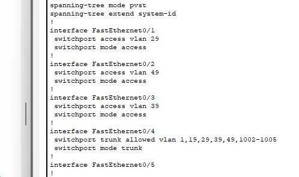
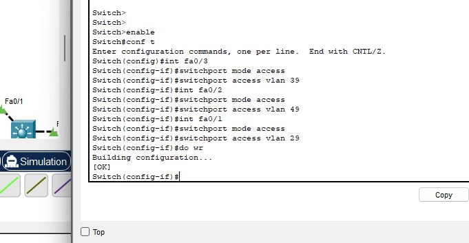
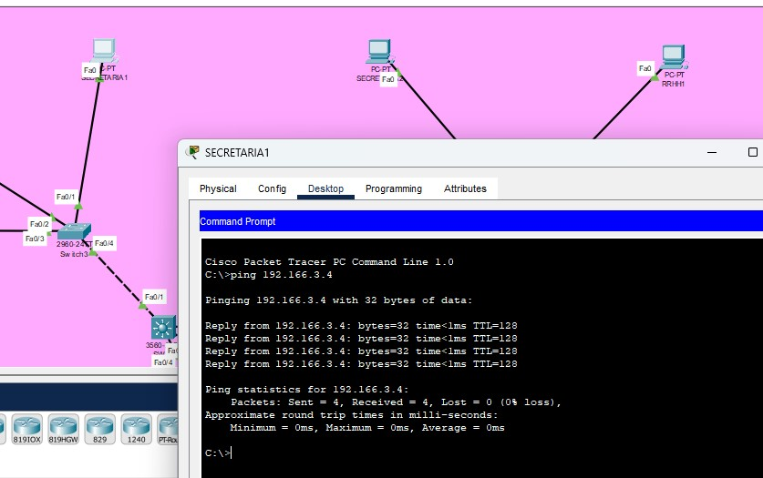

# Proyecto1 
Gerhard Benjamin Ardon Valdez - 202004796
Sebastian Alejandro Velasquez Bonilla - 202006635
Pablo Javier Batz Contreras - 20190298

---
## Resumen de VLAN 
- RRHH           19
- Secretaria     29
- Contabilidad   39
- IT             49

## Area central 
Topologia usada

Configuarcion de la VLAN desde el server sw1



Configuracion de vtp Server desde sw1



### Conf de clients
Se utilizaron los siguientes comandos (f0/x cambia dependiendo del puerto, VLAN cambia dependiendo del dispositivo)
```
enable
conf t 
vtp domain G15
vtp password usac
vtp version 2 
vtp mode client

int f0/1
switchport trunk encapsulation dot1q
switchport mode trunk
switchport trunk allowed vlan 19,29,39,49,1002-1005

int f0/2
switchport mode access
switchport access vlan 40
```

### Oficina A

- Configuracion SW11, SW12, SW13.

- Configuracion SW11 CLIENTE


- Configuracion SW12 CLIENTE


- Configuracion SW13 CLIENTE



- Configuracion Access mode y trunk mode
  


- Vlans finales 
  


- Ping entre area Secretaria


