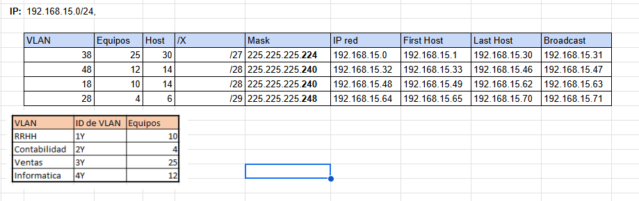
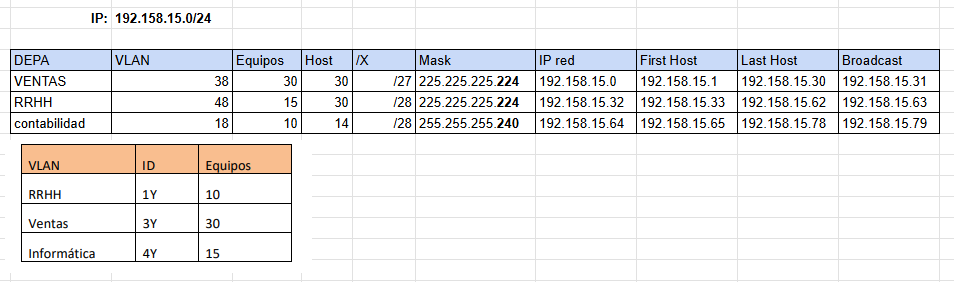

# Sede Jutiapa

## 1. Config de VTP
**VTP Server (ESW1)**
```
enable 
conf t
hostname ESW1
no ip domain-lookup
do wr 

vtp domain redes1
vtp password redes1
vtp version 2
vtp mode server
exit
```
**VTP Client (SW2, SW3)**
```
enable 
conf t
hostname SW2
no ip domain-lookup
do wr 

vtp domain redes1
vtp password redes1
vtp version 2 
vtp mode client
exit
```
## 2. Config de RPVST
**RPVST (ESW1, SW2, SW3)**
```
conf t
spanning-tree mode rapid-pvst
exit

do sh run
```
## 3. Configurar VLANs 
**Crear VLANs (ESW1)**
```
enable
conf t

vlan 18
name Ventas
vlan 28
name Informatica
vlan 38
name RRHH
vlan 48
name Contabilidad
```
**creamos enlaces trunk (ESW1)**
int range fa0/6 - 7
switchport trunk encapsulation dot1q
switchport mode trunk
switchport trunk allowed vlan 18,28,38,48,1002-1005
exit

**root bridge (ESW1)**
``` 
configure terminal
spanning-tree vlan 18 root primary
spanning-tree vlan 28 root primary
spanning-tree vlan 38 root primary
spanning-tree vlan 48 root primary
exit

sh spanning-tree
sh vlan
sh vtp status
```

**creamos enlaces trunk (SW2, SW3)**
int fa0/6 - 7
switchport mode trunk
switchport trunk allowed vlan 18,28,38,48,1002-1005
exit

**creamos enlaces access (SW2, SW3)**
conf t
interface FastEthernet0/1
switchport mode access
switchport access vlan 38
exit
end 
write memory

## 4. LACP 
**(sw2, sw3)**
```
interface range fa0/4-5
switchport mode trunk
channel-group 2 mode active 
no shutdown
```
```
interface range fa0/4-5
switchport mode trunk
channel-group 2 mode passive 
no shutdown
```
`show etherchannel summary `
## 5. Puertas virtuales 
```
interface vlan 18
ip address 192.167.15.1 255.255.255.192  # /26 para VLAN 18
no shutdown
exit

interface vlan 28
ip address 192.167.15.65 255.255.255.224  # /27 para VLAN 28
no shutdown
exit

interface vlan 38
ip address 192.167.15.97 255.255.255.240  # /28 para VLAN 38
no shutdown
exit
```
`show ip interface brief`

# Sede Escuintla

## 1. Config de VTP
**VTP Server (ESW1)**
```
enable 
conf t
hostname ESW1
no ip domain-lookup
do wr 

vtp domain redes1
vtp password redes1
vtp version 2
vtp mode server
exit
```
**VTP Client (SW2, SW3)**
```
enable 
conf t
hostname SW2
no ip domain-lookup
do wr 

vtp domain redes1
vtp password redes1
vtp version 2 
vtp mode client
exit
```
## 2. Config de RPVST
**RPVST (ESW1, SW2, SW3)**
```
conf t
spanning-tree mode rapid-pvst
exit

do sh run
```
## 3. Configurar VLANs 
**Crear VLANs (ESW1)**
```
enable
conf t

vlan 18
name Ventas
vlan 28
name Informatica
vlan 38
name RRHH
vlan 48
name Contabilidad
```

# Sede Quiché


# Sede Petén

## 1. Config de VTP
**VTP Server (ESW1)**
```
enable 
conf t
hostname ESW1
no ip domain-lookup
do wr 

vtp domain redes1
vtp password redes1
vtp version 2
vtp mode server
exit
```
**VTP Client (SW2, SW3)**
```
enable 
conf t
hostname SW2
no ip domain-lookup
do wr 

vtp domain redes1
vtp password redes1
vtp version 2 
vtp mode client
exit
```

## 3. Configurar VLANs 
**Crear VLANs (ESW1)**
```
enable
conf t

vlan 18
name Ventas
vlan 28
name Informatica
vlan 38
name RRHH
vlan 48
name Contabilidad
```
## 4. Puertas virtuales 
```
interface vlan 18
ip address 192.167.15.1 255.255.255.192  # /26 para VLAN 18
no shutdown
exit

interface vlan 28
ip address 192.167.15.65 255.255.255.224  # /27 para VLAN 28
no shutdown
exit

interface vlan 38
ip address 192.167.15.97 255.255.255.240  # /28 para VLAN 38
no shutdown
exit
```
`show ip interface brief`
# Sede Izabal


## 1. Configurar VLANs 
**Crear VLANs (ESW1)**
```
enable
conf t

vlan 18
name Ventas
vlan 28
name Informatica
vlan 38
name RRHH
vlan 48
name Contabilidad
```
## 2. Puertas virtuales 
```
interface vlan 18
ip address 192.167.15.1 255.255.255.192  # /26 para VLAN 18
no shutdown
exit

interface vlan 28
ip address 192.167.15.65 255.255.255.224  # /27 para VLAN 28
no shutdown
exit

interface vlan 38
ip address 192.167.15.97 255.255.255.240  # /28 para VLAN 38
no shutdown
exit
```